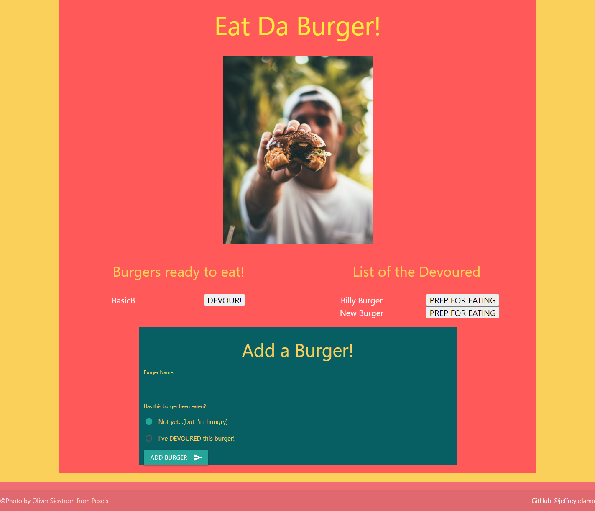

# Eat Da Burger

Jeffrey Adamo  
UW Full Stack BootCamp  
[Eat Da Burger on Heroku](https://ancient-cove-71755.herokuapp.com/)  
[Eat Da Burger on GitHub](https://github.com/jeffreyadamo/EatDaBurger)  

  
***
## Table of Contents
* [Description](#description)

* [Installation](#installation)

* [Usage](#usage)

* [Tests](#tests)

* [Questions](#questions)

## Description

Eat Da Burger is a A full-stack web application using Model View Controller (MVC) design to log burger data. This app's purpose is simple in design where the user can either update the status of a burger or create a new one. This app is used as a learning tool to implement a MySQL-hosted database on Herkoku. 

Features Include:
* MVC design  
* Node.js
* Express.js
* Handlebars.js
* ORM
* Hosted on Heroku with JawsDB
* MySQL
* Materialize CSS framework

  

## Installation

### Please run the following command to install dependencies:


npm i, MYSQL deployment


## Usage

Visit Eat Da Burger at [https://ancient-cove-71755.herokuapp.com/](https://ancient-cove-71755.herokuapp.com/).  
This Node.js application is deployed by [Heroku](https://www.heroku.com/) for front end usage.  

The user is greeted with a landing page asking them to "Eat Da Burger". There are lists of burgers available from the [JawsDB MySQL database](https://devcenter.heroku.com/articles/jawsdb) (hosted as a Heroku add-on) according to the status of their being eaten or not. The user can click a button to change the status from "DEVOUR" (boolean = false) to "PREP FOR EATING" (boolean = true). This will UPDATE the position of the burger's name on the webpage as well as their status in the database. There's also an "Add a Burger!" form where the user can CREATE a burger and its status, which once submitted will reload the page with the new burger in its repective list as it is READ from the database. 

  

## Tests
```
none
```

## Questions

For questions or collaborations, open an issue or contact my GitHub  


    

@ [jeffreyadamo](http://www.github.com/jeffreyadamo)  
<font size="1">GitHub email set as private.</font> 

 