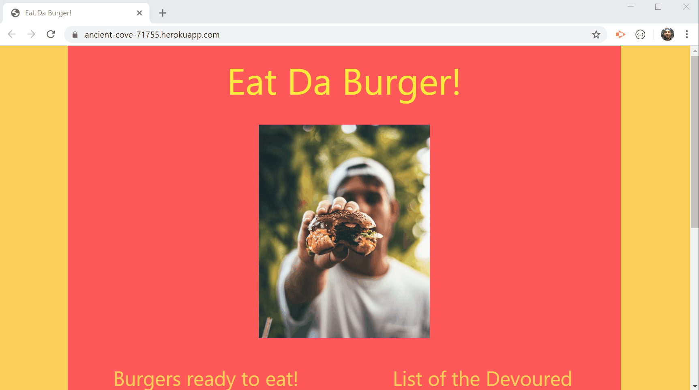

# Eat Da Burger

Jeffrey Adamo  
UW Full Stack BootCamp - Week 13  
[Eat Da Burger on Heroku](https://ancient-cove-71755.herokuapp.com/)  
[Eat Da Burger on GitHub](https://github.com/jeffreyadamo/EatDaBurger)  

  
***
## Table of Contents
* [Description](#description)

* [Installation](#installation)

* [Usage](#usage)

* [MVC](#MVC)

* [Tests](#tests)

* [Issues](#issues)

* [Questions](#questions)

## Description

Eat Da Burger is a full-stack web application using Model View Controller (MVC) design to log burger data. This app's purpose is simple in design where the user can either update the status of a burger or create a new one. This app is used as a learning tool to implement a MySQL-hosted database on Herkoku. 

Features Include:
* MVC design  
* Node.js
* Express.js
* Handlebars.js
* ORM
* Hosted on Heroku with JawsDB
* MySQL
* Materialize CSS framework

  

## Installation for local hosting (otherwise go to go [Usage](#usage))


Clone the repository using the following command:

```
git clone https://github.com/jeffreyadamo/EmployeeTracker_MySQL.git
```

Please run the following command inside the cloned repository folder to install dependencies:

```
npm install
```

To run locally:
* Create a new .env file using .env.sample as an example to input your personal MySQL password.

 * Connect to MySQL using MySQL Workbench or on the command line. Use the info found in /db/schema.sql to create a new "burgers_db" and "burgers" table. 
   
Run the application with the command:  
```
 node server.js
```
Visit [localhost:3000](localhost:3000) on your browser to Eat Da Burger.

## Usage

This Node.js application is deployed by [Heroku](https://www.heroku.com/).

Visit Eat Da Burger online at [https://ancient-cove-71755.herokuapp.com/](https://ancient-cove-71755.herokuapp.com/).  
 

The user is greeted with a landing page asking them to "Eat Da Burger". There are lists of burgers available from the [JawsDB MySQL database](https://devcenter.heroku.com/articles/jawsdb) (hosted as a Heroku add-on) according to the status of their being eaten or not. The user can click a button to change the status from "DEVOUR" (boolean = false) to "PREP FOR EATING" (boolean = true). This will UPDATE the position of the burger's name on the webpage as well as their status in the database. There's also an "Add a Burger!" form where the user can CREATE a burger and its status, which once submitted will reload the page with the new burger in its repective list as it is READ from the database. 

  

## MVC 

This app utilizes Model View Controller (MVC) paradigm. [MVC](https://en.wikipedia.org/wiki/Model%E2%80%93view%E2%80%93controller) is an archetectural pattern that structures our codebase in three distinct sections according to a software design philosopy known as the [separation of concerns](https://en.wikipedia.org/wiki/Separation_of_concerns). MVC will enable our code to be written according to a boilerplate template that can be applied to multiple applications and increase our scalability. Our app is split into modular components that each have a specific role in making the app function. 

### Model


The Model is the data layer of the application. We implement Object-Relational Mapping (ORM) in /config/orm.js to create reusable methods for querying our database. The application's server side JavaScript functions (buttons, form) @ public/assets/js/burger.js will draw from /config/orm.js to then call the ORM functions using burger specific input from the ORM at /model/burger.js which will be used by the controller to render the View.

### View


The View is the template engine used to generate the user interface. This app uses Handlebars.js to generate the HTML head and body components in /views. Data received from the Model by the Controller is rendered.


### Controller


The Controller uses another JavaScript file found at controllers/burgers_controller.js. This file acts as an intermediary between the View and the Model. /burgers_controller.js contains the ROUTER information that will direct the information passed from the database to the browser.  


## Tests
```
none
```
## Issues

* The application exhibits 3 components of the CRUD paradigm. It can CREATE da burger, READ da burger's info from the database, and UPDATE the status of da burger, but you cannot DELETE the burger as the application stands. Adding a DELETE feature would be desired in an updated version of the application.
* Materialize CSS Framework was chosen for front-end styling. Some responsive updates are in order to ensure proper formatting on multiple devices.

## Questions

For questions or collaborations, open an issue or contact my GitHub  


    

@ [jeffreyadamo](http://www.github.com/jeffreyadamo) 